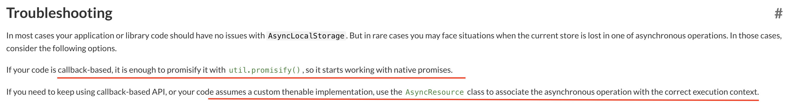

# node-async-hooks

## Considerations

1. Using **AsyncResource** with promiseResolve shall work with promises and callbacks
2. Using **AsyncLocalStorage** it should be pretty simple

## Concerns
1. With **AsyncResource** the console.log being an async implementation, it can cause infinite recurssion. The problem is any 3rd party npm install can have it, if not our code
2. With **AsyncLocalStorage** the warnings present in the Troubleshooting section of official documentation

    
